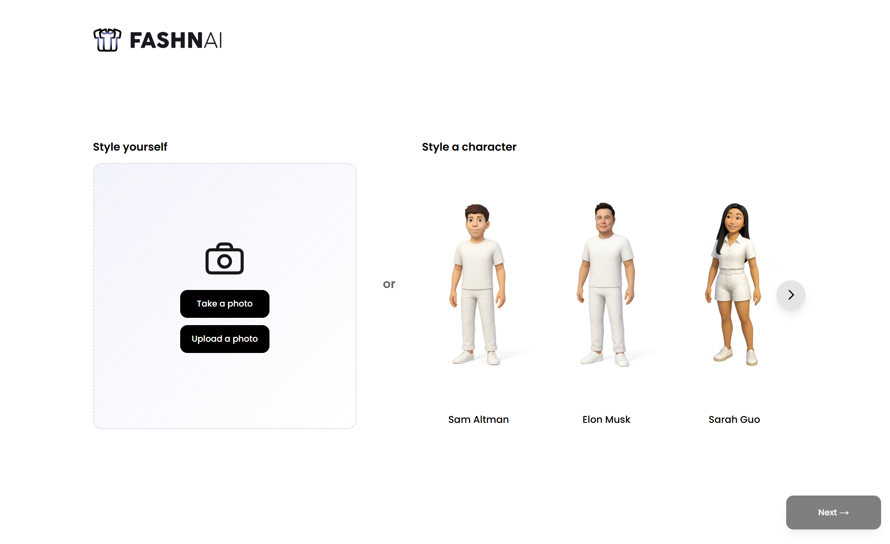

# 👗 Dress to Impress: AI Fashion Showdown

<div align="center">
  
  
  
  
  
</div>

<div align="center">



</div>

Demo: https://youtu.be/s8o59vPj6kY?si=FAzVuD84BG3KDWsQ

###### Built at the SF OpenAI × Cerebral Valley GPT‑5 Hackathon in 24 hours.

---

## Features

### Core gameplay
- **Avatar creation**: Webcam capture → 4 AI-generated avatars (OpenAI Images Edits)
- **Theme challenges**: On-demand theme generation
- **Real-time shopping**: Amazon search via RapidAPI
- **Virtual try-on**: FASHN AI garment try-on
- **AI accessorizing**: Edit accessories/details with OpenAI
- **AI opponent**: GPT-driven agent shops/styles against you
- **Runway video**: Image-to-video with Kling AI
- **AI judge**: Multimodal outfit evaluation

### Game phases
1. **Character Select** — capture and generate avatars
2. **Theme Select** — get a theme challenge
3. **Shopping Spree (1:45)** — search and add items (max 9)
4. **Styling Round (1:30)** — mix and match try-ons
5. **Accessorize** — AI edit for final touches
6. **Evaluation** — AI judge scores both looks
7. **Results** — winner and reasoning

### Technical
- **Next.js 15 + Turbopack**, **React 19**, **TypeScript (strict)**
- **Zustand** state with persistence (IndexedDB)
- **Tailwind CSS 4** UI
- **Server-only API keys**; robust retries/timeouts
- **Sharp** image optimization

## Quick start

### Prerequisites
- Node.js 18.17+
- npm
- API keys (see Configuration)

### Install & run

```bash
# Clone
git clone <repo-url>
cd open-ai-dress2impress

# Install
npm install

# Configure env vars (create .env.local)
printf "OPENAI_API_KEY=\nFASHN_AI_API_KEY=\nRAPIDAPI_KEY=\nRAPIDAPI_HOST=real-time-amazon-data.p.rapidapi.com\n# Optional overrides\n# OPENAI_BASE_URL=https://api.openai.com\n# KLING_ACCESS_KEY=\n# KLING_SECRET_KEY=\n" > .env.local

# Dev server
npm run dev
```

Open [http://localhost:3000](http://localhost:3000).

## Configuration

Required environment variables (`.env.local`):

```env
# OpenAI (avatars, edits, judge, themes, stylist)
OPENAI_API_KEY=your_openai_api_key
# Optional proxy base
# OPENAI_BASE_URL=https://api.openai.com

# Amazon via RapidAPI (shopping)
RAPIDAPI_KEY=your_rapidapi_key
RAPIDAPI_HOST=real-time-amazon-data.p.rapidapi.com

# FASHN AI (virtual try-on)
FASHN_AI_API_KEY=your_fashn_api_key

# Kling AI (runway video, optional)
# KLING_ACCESS_KEY=your_kling_access_key
# KLING_SECRET_KEY=your_kling_secret_key
```

### Optional: Agent base URL configuration

The AI agent performs server-to-server requests (e.g., calling `/api/tryon`) using an absolute base URL. In development, if your Next.js dev server runs on a non-default port, configure one of the following:

- **APP_BASE_URL**: Preferred. Set to the full origin, for example `http://localhost:3002`.
- **APP_PORT** (or **PORT**): Alternatively, set the port; the agent will use `http://localhost:${APP_PORT || PORT || 3000}` as a fallback.

Example `.env.local` entries:

```env
# Agent/API base URL (dev)
APP_BASE_URL=http://localhost:3002
# Alternatively:
# APP_PORT=3002
```

Service setup:
- RapidAPI: subscribe to Real-Time Amazon Data
- OpenAI: Images API + chat completions
- FASHN AI: API access
- Kling AI: API access (optional)

## API routes

- **POST `/api/avatar`** → `{ imageDataUrl }` → `{ images: string[] }` (4 variants)
- **POST `/api/amazon`** → `AmazonSearchRequest` (supports `query` or `categoryId`) → `{ products: [...] }`
- **POST `/api/tryon`** → `{ characterImageUrl, clothingImageUrl }` → `{ images: string[] }`
- **POST `/api/edit`** → `{ baseImageUrl, instruction }` → `{ images: string[] }`
- **POST `/api/ai-style/instruction`** → `{ theme, baseImageUrl }` → `{ instruction: string }`
- **POST `/api/theme`** → `{ context? }` → `{ themes: string[] }`
- **POST `/api/evaluate`** → `{ playerImageUrl, aiImageUrl, theme }` → scores, winner, reasoning
- **POST `/api/video`** → `{ imageUrl }` → `{ url }` (requires Kling credentials)
- **POST `/api/ai-player/run`** → NDJSON stream; accepts `{ theme?, avatarUrl?, durationMs? }`
- **GET `/api/debug/env`** (dev only) → presence flags for env vars

Notes:
- Shopping is 1:45; Styling is 1:30. If the wardrobe hits capacity (9), Shopping may clamp to a shorter remaining timer.
- Wardrobe capacity: **9 items**.

## Development

```bash
# Dev with hot reload
npm run dev

# Lint
npm run lint

# Build & start (production)
npm run build && npm start
```

Debugging:
- Press `D` to toggle the debug panel
- Live AI player logs
- Manual phase controls

## Deployment

### Option A: Docker (Coolify/VPS) — recommended for full demo

Why: No serverless timeouts; long-running routes (avatars/edits/try-on/video) run reliably.

1) Build & run locally (optional):
```bash
docker build -t dress2impress:latest .
docker run --rm -p 3000:3000 \
  -e OPENAI_API_KEY=... \
  -e FASHN_AI_API_KEY=... \
  -e RAPIDAPI_KEY=... \
  -e RAPIDAPI_HOST=real-time-amazon-data.p.rapidapi.com \
  dress2impress:latest
```

2) Coolify setup:
- Create new app from your repo; Dockerfile is included.
- Expose port 3000. Set env vars above in the app settings.
- If placing behind a reverse proxy, ensure `client_max_body_size 20m`.

3) Optional Nginx (example in `deploy/nginx.conf`):
- TLS termination (LetsEncrypt)
- Increase `client_max_body_size`
- Basic per-IP rate limits (optional)

4) Health check:
- `/api/health` returns `{ ok: true }` for uptime monitoring.

### Option B: Vercel (UI only) + separate heavy API (Docker)

Use Vercel for UI and deploy a second container for heavy APIs, then point UI to that API via env vars. This requires minor client tweaks; see comments in `src/lib/api/client.ts` if you choose this path later.

Performance tips
- API routes already use `runtime='nodejs'` and long `maxDuration`.
- Avoid sending very large base64 payloads; URLs are preferred.
- Static assets served via Next; consider CDN if high traffic.

### First-time deployment checklist (Option A)

1) **Prepare infrastructure**
- Point your domain (A/AAAA records) to the VPS IP.
- Ensure ports 80/443 are open; set up TLS (Coolify or Nginx with LetsEncrypt).

2) **Gather environment variables**
- Required: `OPENAI_API_KEY`, `RAPIDAPI_KEY`, `RAPIDAPI_HOST=real-time-amazon-data.p.rapidapi.com`, `FASHN_AI_API_KEY`.
- Optional: `KLING_ACCESS_KEY`, `KLING_SECRET_KEY`, `NEXT_PUBLIC_APP_URL=https://your-domain.com`.

3) **Local Docker testing (recommended)**

**Option 3A: Quick test build (may have static generation issues)**
```bash
# Build the image (note: static generation may fail due to Next.js 15 build issues)
docker build -t dress2impress:latest .

# If build succeeds, run with your API keys
docker run --rm -p 3000:3000 \
  -e OPENAI_API_KEY=your_actual_openai_key_here \
  -e FASHN_AI_API_KEY=your_actual_fashn_key_here \
  -e RAPIDAPI_KEY=your_actual_rapidapi_key_here \
  -e RAPIDAPI_HOST=real-time-amazon-data.p.rapidapi.com \
  dress2impress:latest
```

**Option 3B: Development mode testing (recommended)**
```bash
# Copy your real API keys to .env.local (don't commit this file)
cp .env.example .env.local

# Edit .env.local with your real keys
nano .env.local

# Run in development mode
npm install
npm run dev

# Test health endpoint
curl -s http://localhost:3000/api/health
# Should return: {"ok":false/true,"timestamp":"...","services":{...}}
```

**Option 3C: Manual production build (if Docker fails)**
```bash
# Build production version locally
npm run build
npm start

# Test health endpoint
curl -s http://localhost:3000/api/health
```

4) **Deploy with Coolify**
- Create a new App from this repo; Dockerfile is auto-detected.
- Expose port `3000` and set the environment variables in Coolify dashboard.
- **Important**: If Docker build fails in Coolify due to Next.js static generation, use the "Build Command" override:
  ```bash
  npm install && npm run build -- --no-lint
  ```
- Deploy, then watch logs; the app will listen on port 3000.

5) **Reverse proxy (if applicable)**
- If using an external Nginx/Traefik, increase upload size:
  - Nginx: `client_max_body_size 20m;`
- Proxy to `http://app:3000` or the container IP.

6) **Post-deploy smoke tests**
- Health: `curl -s https://your-domain.com/api/health` should return comprehensive status
- Verify service status shows `"openai":"ok"` for configured APIs
- Open the site in a browser. On first visit in a 3‑hour window, the game auto-resets.
- Verify Shopping timer shows 1:45 and Styling shows 1:30.
- Optional: test a small avatar/edit operation. If external APIs are not configured, expect graceful error messages.

7) **Monitoring & logs**
- Use Coolify logs or `docker logs -f <container>`.
- Monitor `/api/health` endpoint for service health.
- Rate limiting is active: 30 req/min standard, 10 req/5min for AI operations.

8) **Security features active**
- ✅ Rate limiting (per-IP)
- ✅ Security headers (CORS, CSP, XSS protection)
- ✅ API key validation
- ✅ Environment variable checks

9) **Scaling tips**
- Start with 1 vCPU / 1–2 GB RAM. Increase if many concurrent users.
- Rate limiting helps prevent API abuse.
- Monitor `/api/health` for service availability.

## License

MIT — see `LICENSE`.

## Acknowledgments

- OpenAI (avatars, edits, judging, stylist)
- FASHN AI (try-on)
- Amazon via RapidAPI (catalog)
- Kling AI (video)

<div align="center">
  <sub>Built by the Dress to Impress team</sub>
</div>